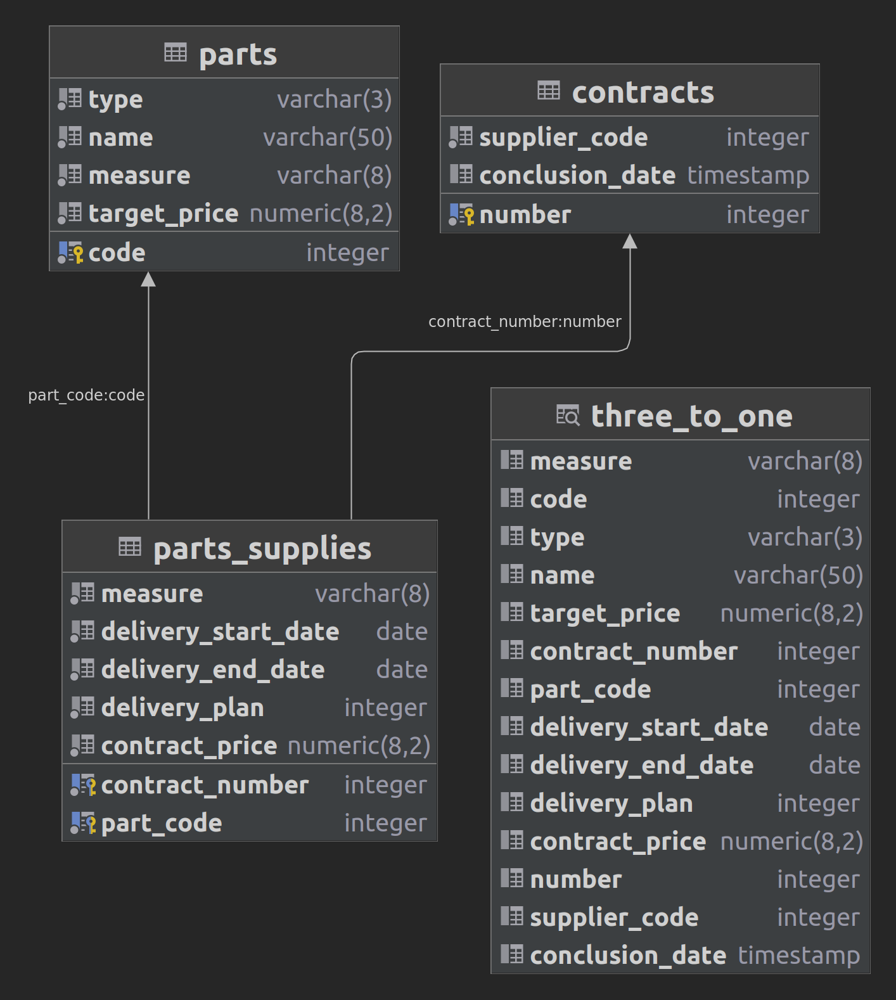

# Read Java app



```
materials/              -> Доп файлы (весь sql-скрипт тут)
src/main/java           -> Application/Library sources
src/main/resources      -> Application/Library resources
target/                 -> All output of the build
pom.xml                 -> Files descriptive of the project
README.md               -> Project's readme
```

#### В "Задании 1"
```
http://localhost:8080/parts-supplies/task1?date=2021-01-01
```

#### вместо '2021-01-01' можно написать свою дату, в формате: "year:month:day"

#### P. S. "three_to_one" - VIEW
